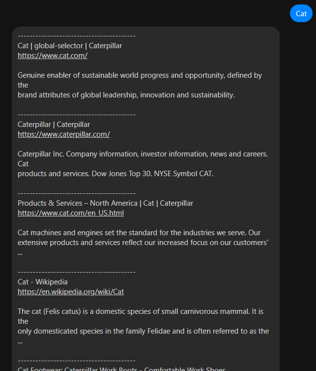
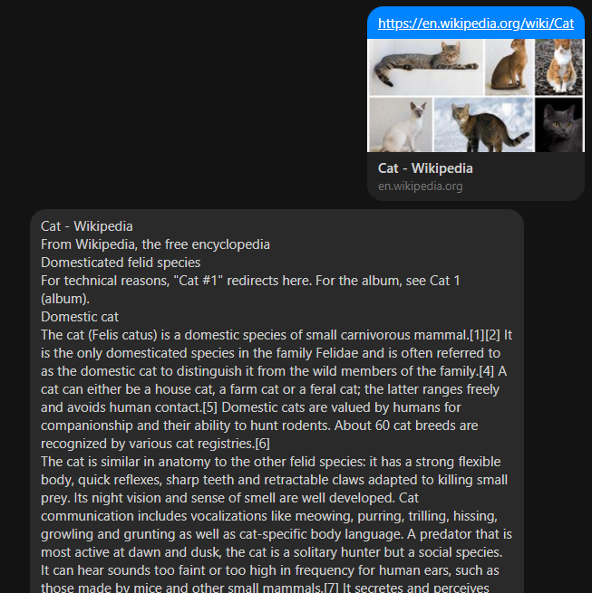

# Searchinator
 A Messenger chatbot that performs Google search queries. This was designed to help alleviate the problems of online students who are unable to browse the internet outside of using free Facebook Messenger mobile data. The chatbot allows for light, limited browsing that lets you fetch important information online while you're on the go.
 
 You can view the deployment [here](https://www.messenger.com/t/103831598283807).

# Usage
You can send a message as a string and the bot will perform a Google search for you with a list of links and descriptions.

From the list of results, you can also retrieve a specific webpage. The bot will scrape that URL and return the contents to you as plaintext.

# Setting Up
1. Get API keys for [Google custom search](https://developers.google.com/custom-search/v1/overview) and (Facebook Messenger)[https://developers.facebook.com/docs/messenger-platform/getting-started]
2. Store the API keys into the directory's environment variables. Examples for the variable names are showin in the `sample.env` file.
3. Host the chatbot in a web server of your choosing. HTTP protocols are found in `app.py`
4. Take the address of your server and [set it as the webhook](https://developers.facebook.com/docs/messenger-platform/webhook) of your app in Messenger.